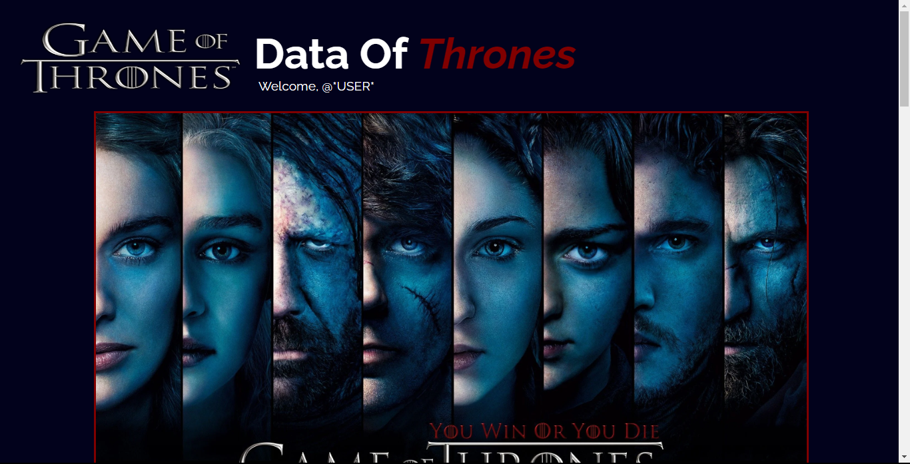

# Data Of Thrones
#### This is a Game Of Thrones data webpage created using HTML, CSS, JS and SwaggerAPI.
#### By Wayne Otido

## Description
This is a Game Of Thrones data webpage that allows users to read info on the show, watch its trailer, view its character details and share their opinion in the comments. 



# How to use
### Requirements
  * A computer
  * Internet access

### View live site
Click the link provided below to access the site in your browser

https://wayne-otido.github.io/DataOfThrones/

### Using the website
Users are able to:
  * View the Series poster
  * Click to watch the series trailer
  * Read the series details
  * View the list of characters 
  * Click on a character to view their data
  * Post a comment/review in the comment form

## Run Locally
### Setup/Installation Requirements
To run this app locally, you need a PC with:
* Access to the internet

### Installation Process
  1. Clone this repository using

    ```bash
      git clone git@github.com:wayne-otido/DataOfThrones.git
    ```
  2. Open the index.html file in your preferred browser.
    ```bash
      open index.html
    ```

# Technologies used
  * HTML
  * CSS
  * JS


